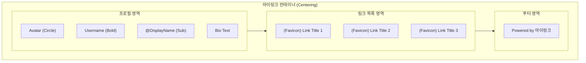

# [Wireframe] 마이링크 메인 화면 (방문자용)

본 문서는 방문자가 마이링크(My Link) 페이지에 접속했을 때 보게 되는 메인 화면의 시각적 구조를 정의합니다.

---

## 1. ASCII 아트 와이어프레임

```text
                                                [내 페이지 보기]
+---------------------------------------------+
|                                             |
|                [ 프로필 이미지 ]               |
|                                             |
|                   Username [✏️]             |
|                 @DisplayName [✏️]           |
|                                             |
|        "안녕하세요! 저의 링크 모음입니다." [✏️]    |
|                                             |
+---------------------------------------------+
|                                             |
|   +-------------------------------------+   |
|   | [📎] 첫 번째 링크 제목 [✏️]           |   |
|   +-------------------------------------+   |
|                                             |
|   +-------------------------------------+   |
|   | [📎] 두 번째 링크 제목 [✏️]           |   |
|   +-------------------------------------+   |
|                                             |
|   +-------------------------------------+   |
|   | [📎] 세 번째 링크 제목                 |   |
|   +-------------------------------------+   |
|                                             |
+---------------------------------------------+
|           Created with 마이링크              |
+---------------------------------------------+
```

---

## 2. Mermaid 구조 다이어그램



---

## 3. 화면 구성 요소 상세 설명

### 3.1. 관리 기능 (Admin UI)
- **내 페이지 보기**: 화면 우측 상단에 고정된 버튼으로, 방문자가 보게 될 실제 페이지를 새 탭으로 확인합니다.
- **편집 아이콘 (✏️)**: Username, DisplayName, Bio, 링크 제목 등 모든 편집 가능 영역 옆에 연필 아이콘을 항상 표시하여 인라인 편집이 가능함을 직관적으로 알립니다.

### 3.2. 프로필 영역
- **프로필 이미지**: 구글 계정에서 가져온 이미지를 원형으로 노출합니다.
- **Username [✏️]**: 실제 이름을 노출하며, 클릭 시 즉시 수정한 후 연필 아이콘 주위의 인터랙션을 통해 저장을 확인합니다.
- **DisplayName [✏️]**: URL 슬러그로 사용되는 닉네임을 노출하며, 역시 인라인 편집을 지원합니다.
- **Bio [✏️]**: 사용자가 설정한 한줄 소개를 노출합니다.

### 3.3. 링크 목록 영역
- **세로 배열**: 모든 링크는 모바일 환경을 고려하여 세로로 길게 나열됩니다.
- **파비콘(Favicon)**: 링크 제목 좌측에 구글 API를 통해 가져온 웹사이트 아이콘이 노출됩니다.
- **편집 모드**: 각 링크 아이템 우측에 연필 아이콘이 있으며, 클릭 시 제목과 URL을 즉시 수정할 수 있습니다.

---

## 4. 제안하는 개선 사항
1. **소셜 아이콘 레이어**: 주요 SNS(Instagram, Twitter 등)는 텍스트 링크 대신 프로필 바로 하단에 작은 아이콘 버튼으로 배치하여 접근성을 높일 수 있습니다.
2. **배경 패턴**: 단순한 단색 배경 대신, 은은한 그라데이션이나 기하학적 패턴을 적용하여 단조로움을 피할 수 있습니다.
3. **스켈레톤 로딩**: 파비콘이나 데이터를 불러오는 동안 요소들이 깜빡이지 않도록 스켈레톤 UI를 적용하는 것이 좋습니다.
